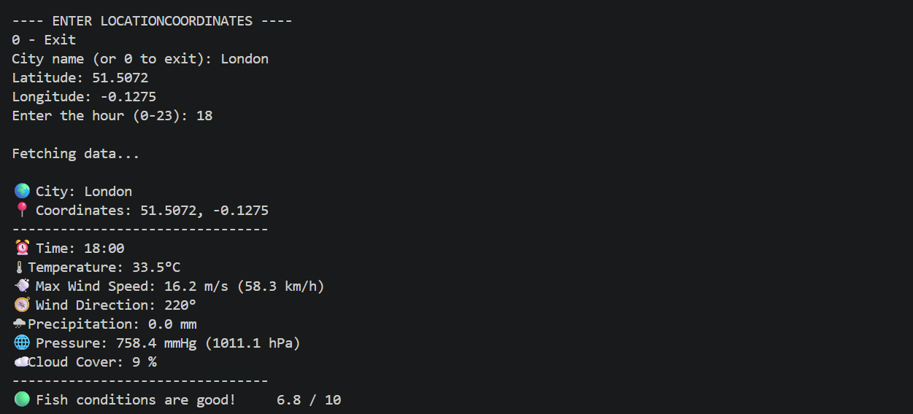

# Weather and Fishing Forecasts

A Python application that uses weather data from Open-Meteo API to analyze fishing conditions and calculate fishing activity score.

## Features

- Get weather data using Open-Meteo API
- Analyze fishing conditions based on weather factors
- Calculate fishing activity score from 0 to 10
- Analyze:
  - Temperature
  - Wind speed
  - Wind direction
  - Air pressure changes
  - Cloud cover
  - Time of day
- Search weather by city name

## Technologies

- Python 3
- Requests
- Open-Meteo API
- JSON

## Installation

1. Clone the repository:

```bash
git clone https://github.com/your-username/weather-and-fishing-forecasts.git
```

2. Install the required library:

```bash
pip install -r requirements.txt
```

3. Run the program:

```bash
python main.py
```

## Usage

1. Run the program.
2. Enter the city name.
3. Enter the desired hour (0–23).
4. Receive the weather forecast and fishing activity score for the selected city and hour.

## Example

Example of program output:

```text
City: London
Hour: 6:00
--------------------------------
Temperature: 22°C
Wind: 3 m/s (10,8 km/h)
Wind Direction: 180°
Precipitation: 0.0 mm
Pressure: 760 mmHg (1013,25 hPa)
Cloud Cover: 70%
--------------------------------
Fishing activity is excellent!     8.5/10

## Screenshot
Example of program outpot:

## Future Improvements

- Add city search instead of entering coordinates
- Add weather forecast for multiple days
- Improve fishing activity calculation algorithm
- Add data visualization with charts
- Add error handling for API requests
- Create automated tests using pytest
- Add graphical user interface (GUI)